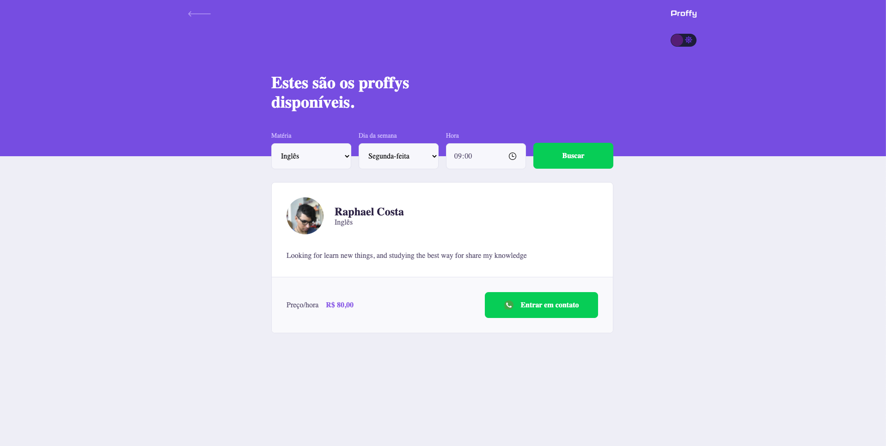
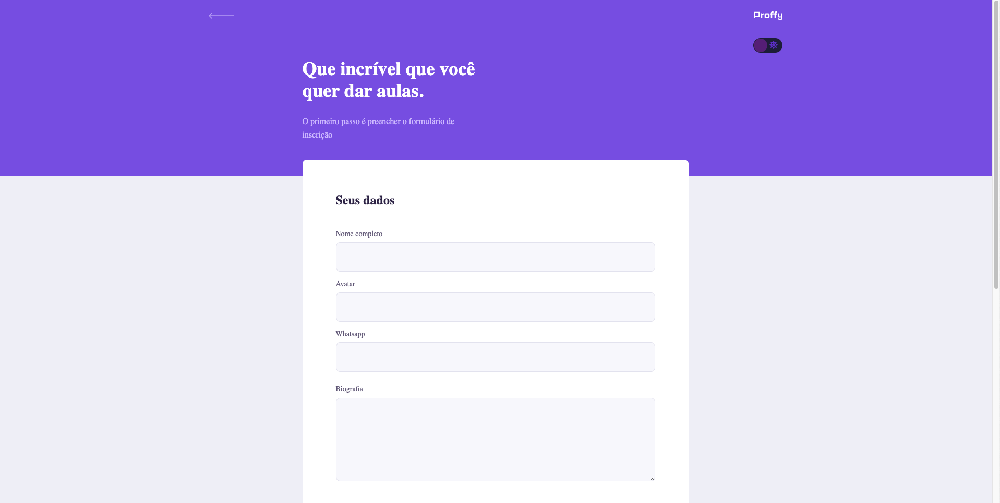
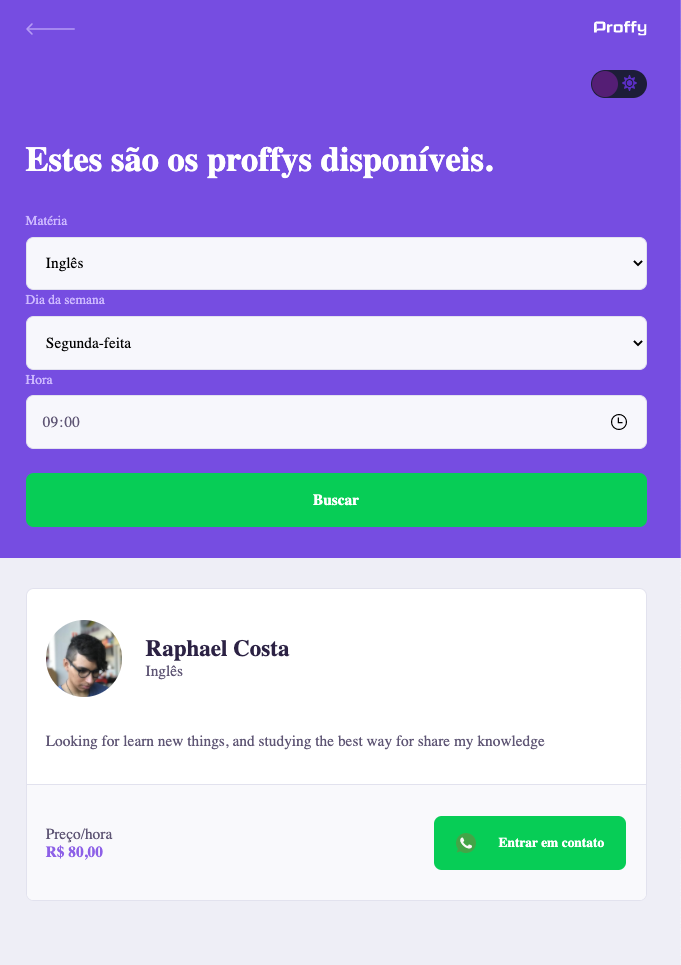
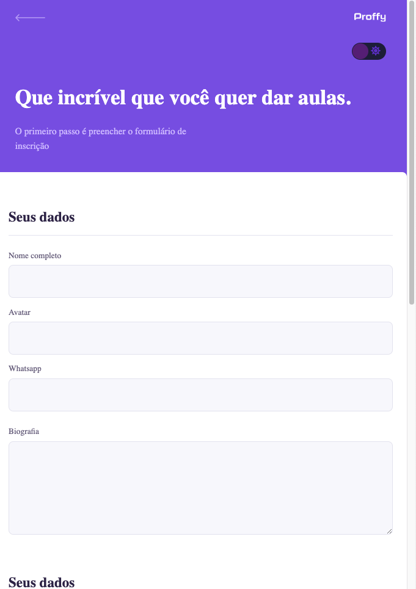

  

    
  

  
  
  
  

    
    <h2>
      Made with 💜
    </h2>
  

# 📷 Screenshots

## 💻 Web

  

    
    
  

  

    
  

## 📱 Mobile

  
  
  

# 📚 About Project

> Proffy is an application made for the purpose of easily connecting students and teachers. Through this application, students can find teachers and get in touch with them. For proffys, they can gather students and schedule classes. And even more, with responsiveness, you can open the application on your mobile phone browser or on your computer, making it easier, and delivering a better UX.

# 🚀 Running 

 To run this application, clone this repository by: `$ git clone https://github.com/raphaacosta/Proffy-Web.git`.
 - Install the dependencies by: `$ yarn install`.
 - Run `$ yarn start` (if the browser don't open, open it and access `localhost:3000`)

# 📌 Techs

 - [Yarn](https://classic.yarnpkg.com/en/docs/install/#mac-stable)
 - [Typescript](https://www.typescriptlang.org/)
 - [React.js](https://pt-br.reactjs.org/)
 - [Styled-components](https://styled-components.com/)
 - [Axios](https://www.npmjs.com/package/axios)

# 👍 Contribute

  If you find an bug, feel free to open an pull request or an issue.
  If you want to improve this project, just do it ➡️ :
  - Clone this repository: `$ git clone https://github.com/raphaacosta/Proffy-Web.git`.
  - Create a branch with your feature: `$ git checkout -b my-feature`.
  - Commit your changes: `$ git commit -m 'feat: my new feature'`.
  - Push your branch: `$ git push origin my-feature`.